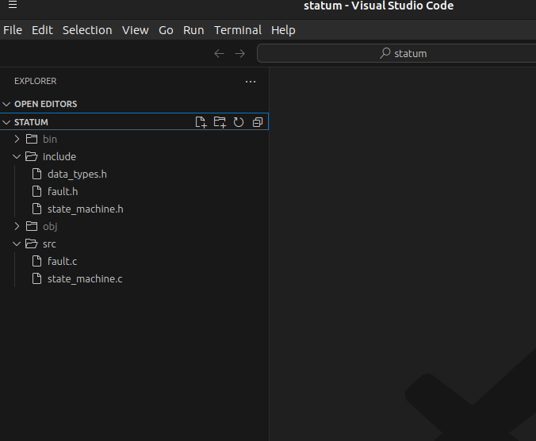

# OpenFramework
## OpenPlatform Specifications

### Section I

**Project Structure**

This is a very quick and rudimentary introduction to project and directory structure.

The root is a repository - in this case *open_framework*. The focus is the individual projects themselves. What should be included in a repo is only what is necessary for that repo. This particular repository is a prototype. It will be changing through several iterations.

The project source we want to look at is *statum*.

**Statum** is a [state machine implementation](https://www.codeproject.com/Articles/1275479/State-Machine-Design-in-C) by [David Lafreniere](https://www.codeproject.com/script/Membership/View.aspx?mid=4425742). **Note**: *Within that original source, David implemented some allocation optimisations that I've excluded for the time being.*

Let's zero in on the *statum* directory:
1. right-click *statum*
2. right-click *Open with...*
3. select *VS Code*  
  <small>*note: trying to get a screen shot of the context menus on Linux is not simple (scrot is not working)*</small>

When VS Code opens, you will see this directory structure:

| :-------------- | :--------------: | --------------: |
| [Intro](intro.md)       |   [Table of Contents](../README.md)   | [Languages](languages.md) |
