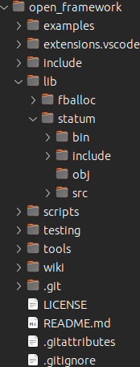

# OpenFramework
## OpenPlatform Specifications

### Section I

**Project Structure**

This is a very quick and rudimentary introduction to project and directory structure.

The root is a repository - in this case *open_framework*. The focus is the individual projects themselves. What should be included in a repo is only what is necessary for that repo. This particular repository is a prototype. It will be changing through several iterations.

The project source we want to look at is *fballoc*.
