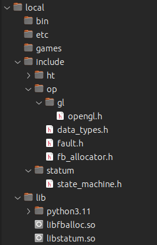
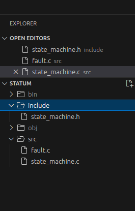
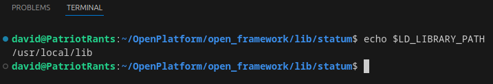

# OpenFramework
## OpenPlatform Specifications

### Section III

**Reusable Code (_Modular Development_)**

Using shared libraries (objects) is the key to modularized *components*.

On Linux, the specification expects the developer to be familiar and comfortable with accessing `usr/local/lib` and `usr/local/include`.

The *`usr/local/include`* directory, should resemble the logical structure of your *project's* `/include` directory.  

| *directory* | *vscode* |  
| :---: | :---: |  
|  |  |  

#### Making a *shared object* (.so) or dynamically linked library.

Create a source project (download one of the projects from the **OpenFramework** repository). If you choose to download a library, I'd recommend *fb_allocator*. It is a base component, meaning there are no other libraries on which it depends. *statum* depends on *fb_allocator*. So, you have to have the *libfballoc.so* prior to linking *statum*.

Use the following **GCC** command to **_compile_** the source:
> `gcc -shared -fpic -o bin/mylib.so src/*.c`  

This creates a *shared object* in the *`bin`* directory. Replace `mylib` with the name you want to use for your library. Next copy the *`.so`* file to *`usr/local/lib`*.
Next is the linking process. In order for the linker (*ld* under the hood), the `LD_LIBRARY_PATH` must be updated with the appropriate location.

From the command line, enter the following:
> `// replace 'gedit' with your editor`  
> `sudo gedit ~/.bashrc`

Add this to the bottom:
> `export LD_LIBRARY_PATH=/usr/local/lib`

Then save and close. In your command line enter:
> `source ~/.bashrc`

This will reload the environment variables. Test it from the *VS Code Terminal* like so:


To link, say *statum* (also a shared object) to *fballoc*, we would do the following:
> `gcc -shared -fpic -o bin/libfballoc.so src/*.c`

Now we have one shared object linked to another.

As part of the OpenPlatform specification, all the *header* (`.h`) files should be organized in the *`usr/local/include`* directory. This makes all the headers available to any source. Those headers are not part of the final shared objects or executables.

When you are working on a project, your `#include` preprocessor should reference the project's *`include`* directory. If your source is referencing a shared object, the `#include` directive should reference the *`usr/local/include`* directory.

All of these specifications are intended to create a standard between all developer systems. Since this specification is still in its infancy, it is within expectation that structures could change. Final specification will be annotated appriately so that everyone will know how to follow the standard.

At some point, it is likely that there will be a `build_dll ` executable to perform all the steps above. Likely, also a `link_dll`. These will use JSON configurations to assist in switches and options. To add value to the idea of custom *build* tooling, the specification may require documentation via `#pragma` directives. These would build documentation at compile time, ensuring a high level of quality be standardized.

The real usefulness in a custom build tool is with the following project, [`motor`](https://github.com/TheBadkraft/open-framework/tree/main/examples/motor). Remember that `statum` references `fballoc`. The project `motor` references both of those. So, `motor` must be linked to both shared libraries. We will compile and link `motor` and then verify that it is properly linked to both `statum` and `fballoc`.

First, enter the following:
> `gcc -o bin/motor src/*.c -lstatum -lfballoc`

Assuming no errors, we just want to make sure we link to the right `.so` files at the correct locations, etc, etc.
> `ldd ./bin/motor`

Output:
>        linux-vdso.so.1 (0x00007ffecadeb000)
>        libstatum.so => /usr/local/lib/libstatum.so (0x00007f062528e000)
>        libfballoc.so => /usr/local/lib/libfballoc.so (0x00007f0625289000)
>        libc.so.6 => /lib/x86_64-linux-gnu/libc.so.6 (0x00007f0625000000)
>        /lib64/ld-linux-x86-64.so.2 (0x00007f062529a000)

Here you can see all the dependencies for your source executable. Lines 2 & 3 list our linked libraries.

Using **VSCode** we will be able to forego all the terminal commands throughout developement. The folder structure makes it easy to copy *`tasks.json`* across projects.
>! *tasks.json*
	``` json
	{
		"version": "2.0.0",
		"tasks": [
			{
				"label": "build",
				"type": "cppbuild",
				"command": "/usr/bin/gcc",
				"args": [
					"-o",
					"${workspaceFolder}/../bin/${workspaceFolderBasename}_tests",
					"${workspaceFolder}/*.c",
					"-l_string",
					"-l_except"
				],
				"problemMatcher": [
					"$gcc"
				],
				"group": "build",
				"detail": "compiler: gcc"
			},
			{
				"label": "build debug",
				"type": "cppbuild",
				"command": "/usr/bin/gcc",
				"args": [
					"-g3",
					"-o",
					"${workspaceFolder}/../bin/${workspaceFolderBasename}_dbg_tests",
					"${workspaceFolder}/*.c",
					"-l_string",
					"-l_except"
				],
				"problemMatcher": [
					"$gcc"
				],
				"group": "build",
				"detail": "compiler: gcc"
			},
			{
				"label": "build so",
				"type": "cppbuild",
				"command": "/usr/bin/gcc",
				"args": [
					"-shared",
					"-fpic",
					"-o",
					"${workspaceFolder}/../shared/lib_${workspaceFolderBasename}.so",
					"${workspaceFolder}/${workspaceFolderBasename}*.c",
					"-l_string"
				],
				"problemMatcher": [
					"$gcc"
				],
				"group": "build",
				"detail": "compiler: gcc"
			},
			{
				"label": "debug so",
				"type": "cppbuild",
				"command": "/usr/bin/gcc",
				"args": [
					"-g3",
					"-o",
					"${workspaceFolder}/../bin/shared_${workspaceFolderBasename}",
					"${workspaceFolder}/test.c",
					"-l_string",
					"-l_except",
					"-l_${workspaceFolderBasename}"
				],
				"problemMatcher": [
					"$gcc"
				],
				"group": "build",
				"detail": "compiler: gcc"
			},
		]
	}
	```
>!  


| Previous | | Next |  
| :-------------- | :--------------: | --------------: |  
| [Languages](languages.md)       |   [Table of Contents](../README.md)   | [Extensibility](extensibility.md) |
